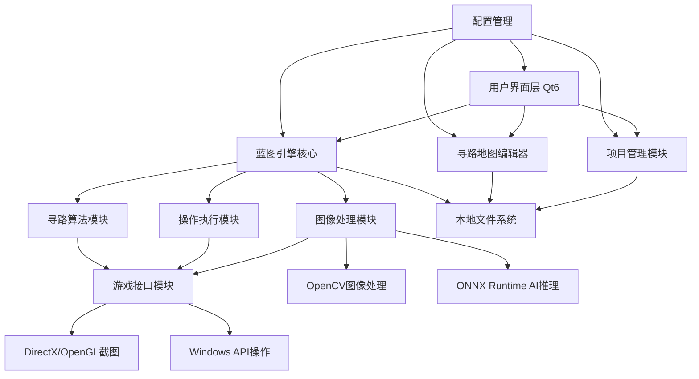
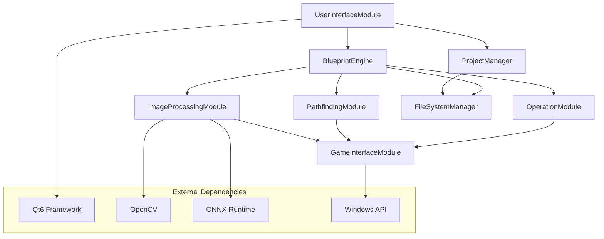
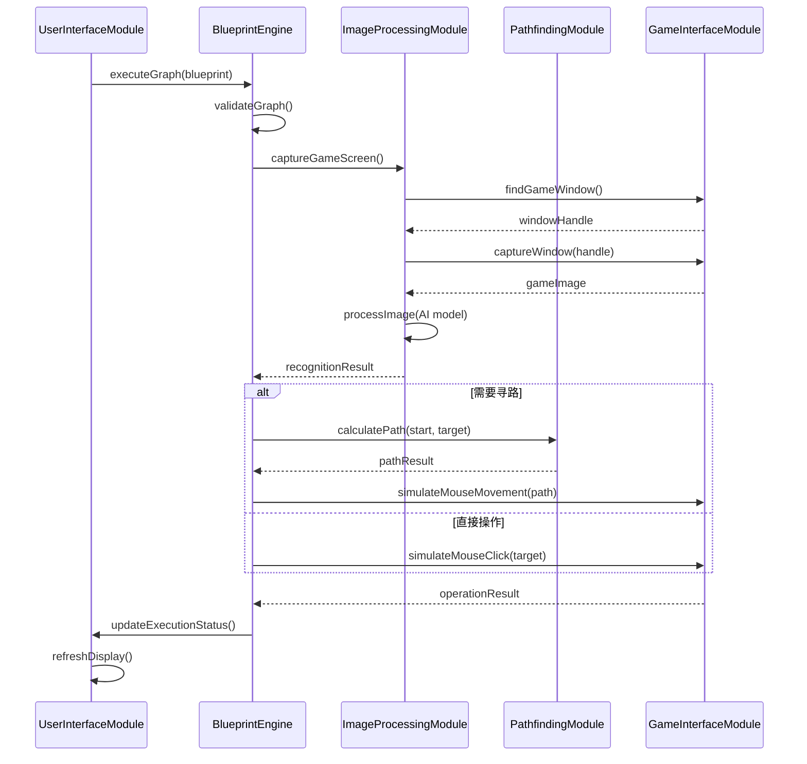
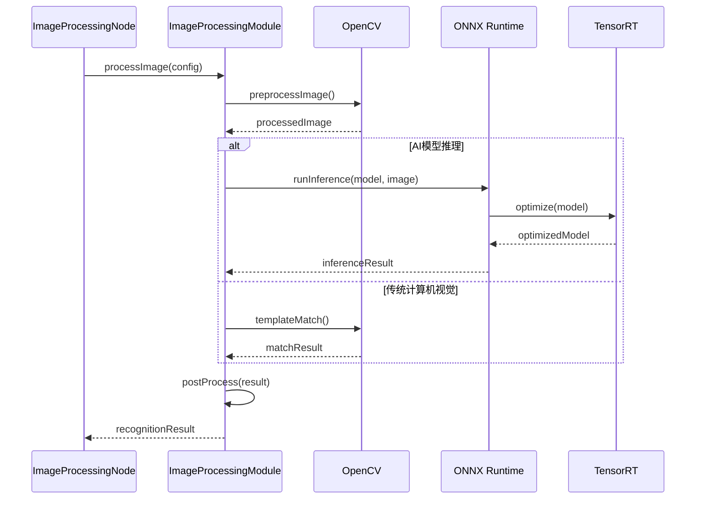

# 无限蓝图游戏脚本开发框架 Architecture Document

## Introduction

本文档定义了"无限蓝图游戏脚本开发框架"的整体项目架构，包括后端系统、共享服务和非UI特定的技术关注点。其主要目标是作为AI驱动开发的指导架构蓝图，确保技术选择的一致性并遵循已确定的模式和技术标准。

**与前端架构的关系：**
由于该项目是一个重要的用户界面密集型桌面应用程序，将单独创建前端架构文档来详细说明前端特定的设计。本文档中记录的核心技术栈选择（参见"技术栈"部分）对整个项目（包括任何前端组件）都是决定性的。

### Starter Template or Existing Project

**项目基础确认：** 这是一个全新的C++桌面应用程序项目，专为Windows平台设计。项目采用Qt6作为GUI框架，集成OpenCV进行图像处理，支持DirectX/OpenGL游戏截图。

**技术基础确认：**
- 这是一个从零开始的绿地项目（不基于现有代码库）
- 将采用现代C++20标准和模块化架构设计
- 集成多个专业技术库（Qt6、OpenCV、TensorRT等）
- 采用CMake构建系统和vcpkg包管理器

### Change Log

| Date | Version | Description | Author |
|------|------|-------------|--------|
| 2025-08-23 | 1.0 | 初始架构文档创建，基于PRD v1.0 | Architecture Agent |

## High Level Architecture

### Technical Summary

本系统采用模块化单体架构设计，基于C++20和Qt6框架构建高性能Windows桌面应用程序。核心架构包含五个主要模块：蓝图引擎、图像处理、寻路算法、UI交互和游戏接口。系统通过事件驱动的消息传递机制实现模块间通信，采用插件化设计支持功能扩展。整体架构支持PRD目标：100-500节点蓝图编辑、≤100ms执行延迟、≤200ms图像处理，为游戏脚本开发提供专业级的可视化编程环境。

### High Level Overview

**主要架构风格：** 模块化单体架构 - 选择单体架构因为游戏脚本需要极低延迟，避免网络开销；采用模块化设计确保代码可维护性和功能扩展性。

**仓库结构决策：** 单一代码仓库管理整个项目，便于代码共享、依赖管理和协调开发。

**服务架构决策：** C++模块化单体架构 + Qt6 GUI框架，核心模块包括：蓝图引擎模块、图像处理模块、寻路算法模块、UI交互模块、游戏接口模块。

**主要用户交互流程：** 用户通过Qt6 GUI创建蓝图 → 蓝图引擎解析执行 → 图像处理模块截取游戏画面 → AI推理识别目标 → 操作执行模块模拟用户输入 → 寻路模块计算移动路径 → 实时反馈显示执行状态。

**关键架构决策：**
- 选择Qt6的Graphics View Framework优化大量节点的渲染性能
- 采用ONNX Runtime支持多种AI模型，提升图像识别准确率
- 使用Intel TBB并行计算框架，充分利用多核CPU资源
- 实现自定义内存池分配器，减少频繁内存分配开销

### High Level Project Diagram



### Architectural and Design Patterns

**模块化单体模式：** 将应用程序组织为松耦合的功能模块，每个模块负责特定的业务领域 - _理由：_ 平衡开发效率与系统性能，便于团队协作开发

**事件驱动架构：** 使用Qt的信号槽机制实现模块间异步通信 - _理由：_ 提升系统响应性，支持并行处理，降低模块间耦合度

**插件架构模式：** 节点类型和算法实现采用插件化设计 - _理由：_ 支持功能扩展，便于第三方开发者贡献新节点类型

**观察者模式：** 蓝图执行状态通过观察者模式通知UI更新 - _理由：_ 实现执行引擎与UI的解耦，支持多种显示形式

**工厂模式：** 节点创建和AI模型加载使用工厂模式 - _理由：_ 简化对象创建，支持动态类型选择和配置

**内存池模式：** 高频分配的对象使用内存池管理 - _理由：_ 减少内存分配开销，提升实时性能，避免内存碎片

## Tech Stack

### Cloud Infrastructure

- **Provider:** 本地桌面应用，无云服务依赖
- **Key Services:** Windows本地服务（文件系统、注册表、DirectX/OpenGL）
- **Deployment Regions:** Windows 10/11桌面环境

### Technology Stack Table

| Category | Technology | Version | Purpose | Rationale |
|----------|------------|---------|---------|-----------|
| **Language** | C++ | 20 | 核心开发语言 | 高性能、内存控制、成熟生态 |
| **GUI Framework** | Qt | 6.6+ | 用户界面开发 | 成熟的跨平台GUI、Graphics View优秀 |
| **Build System** | CMake | 3.25+ | 项目构建管理 | 现代C++支持、跨平台、依赖管理 |
| **Package Manager** | vcpkg | latest | 第三方库管理 | Microsoft官方支持、C++生态完善 |
| **Image Processing** | OpenCV | 4.8+ | 图像处理核心 | 业界标准、性能优秀、文档完善 |
| **AI Inference** | ONNX Runtime | 1.16+ | AI模型推理 | 跨平台、多硬件后端支持 |
| **GPU Acceleration** | TensorRT | 8.6+ | NVIDIA GPU加速 | 专门优化AI推理性能 |
| **Parallel Computing** | Intel TBB | 2021.10+ | 并行计算框架 | 充分利用多核CPU资源 |
| **Testing Framework** | Google Test | 1.14+ | 单元测试 | C++标准测试框架 |
| **Geometry Algorithms** | CGAL | 5.5+ | 计算几何 | 高质量空间数据结构 |
| **JSON Processing** | nlohmann/json | 3.11+ | 配置文件处理 | 现代C++ JSON库 |
| **Logging** | spdlog | 1.12+ | 日志记录 | 高性能、多输出格式 |
| **Game Interface** | Windows API | Win32/Win64 | 系统级操作 | 鼠标键盘模拟、窗口管理 |

## Data Models

### BlueprintNode

**Purpose:** 蓝图编辑器中的基础节点类型，承载脚本逻辑的最小单元

**Key Attributes:**
- id: string - 唯一标识符
- type: NodeType - 节点类型枚举
- position: Point2D - 画布坐标位置
- inputs: vector<NodePort> - 输入端口列表
- outputs: vector<NodePort> - 输出端口列表
- parameters: map<string, Variant> - 节点参数配置
- comment: string - 用户备注信息
- state: NodeState - 执行状态

**Relationships:**
- 通过NodeConnection连接到其他节点
- 属于特定的BlueprintGraph
- 可包含子节点（复合节点）

### BlueprintGraph

**Purpose:** 完整的蓝图脚本结构，包含所有节点和连接关系

**Key Attributes:**
- id: string - 图表唯一标识
- name: string - 用户定义名称
- nodes: vector<BlueprintNode> - 节点列表
- connections: vector<NodeConnection> - 连接关系
- variables: map<string, Variable> - 图表变量
- metadata: GraphMetadata - 版本、创建时间等元信息

**Relationships:**
- 包含多个BlueprintNode
- 属于特定的Project
- 可以被ExecutionEngine执行

### ImageRecognitionModel

**Purpose:** AI图像识别模型的配置和状态管理

**Key Attributes:**
- modelPath: string - ONNX模型文件路径
- modelType: RecognitionType - 识别类型（模板匹配/对象检测等）
- inputSize: Size2D - 模型输入尺寸
- confidence: float - 置信度阈值
- preprocessConfig: PreprocessConfig - 预处理配置

**Relationships:**
- 被ImageProcessingNode引用
- 关联多个RecognitionResult

### PathfindingMap

**Purpose:** 寻路系统的地图数据结构

**Key Attributes:**
- mapId: string - 地图唯一标识
- dimensions: Size2D - 地图尺寸
- obstacles: vector<Polygon> - 障碍物区域
- safeZones: vector<Polygon> - 安全区域
- waypoints: vector<Point2D> - 路径点
- gridResolution: float - 网格精度

**Relationships:**
- 被PathfindingNode使用
- 关联多个PathfindingResult

## Components

### BlueprintEngine

**Responsibility:** 蓝图脚本的解析、编译和执行引擎，系统的核心计算模块

**Key Interfaces:**
- executeGraph(BlueprintGraph): ExecutionResult
- validateGraph(BlueprintGraph): ValidationResult
- pauseExecution(): void
- resumeExecution(): void

**Dependencies:** ImageProcessingModule, PathfindingModule, OperationModule

**Technology Stack:** C++20 协程、自定义虚拟机、Qt信号槽系统

### ImageProcessingModule

**Responsibility:** 游戏画面截取、图像预处理、AI模型推理和结果分析

**Key Interfaces:**
- captureGameScreen(WindowHandle): Image
- processImage(Image, RecognitionConfig): RecognitionResult
- loadModel(ModelPath): ModelHandle
- batchProcess(vector<Image>): vector<RecognitionResult>

**Dependencies:** GameInterfaceModule, ONNX Runtime, OpenCV

**Technology Stack:** OpenCV 4.8+、ONNX Runtime、TensorRT GPU加速

### PathfindingModule

**Responsibility:** 路径规划算法、地图数据管理和寻路结果计算

**Key Interfaces:**
- calculatePath(start, end, map): PathResult
- updateMap(MapData): void
- optimizePath(Path): OptimizedPath
- validatePath(Path, Map): ValidationResult

**Dependencies:** CGAL几何库、Boost.Geometry

**Technology Stack:** A*算法、JPS跳点搜索、分层寻路、CGAL计算几何

### GameInterfaceModule

**Responsibility:** 与游戏进程交互，包括窗口管理、截图捕获和操作模拟

**Key Interfaces:**
- findGameWindow(ProcessName): WindowHandle
- captureWindow(WindowHandle): Image
- simulateMouseClick(Point): void
- simulateKeyPress(KeyCode): void

**Dependencies:** Windows API、DirectX/OpenGL hooks

**Technology Stack:** Win32 API、DirectX截图、输入模拟、进程管理

### UserInterfaceModule

**Responsibility:** Qt6 GUI界面、用户交互处理和视觉反馈系统

**Key Interfaces:**
- createBlueprintEditor(): EditorWidget
- updateNodeStatus(NodeId, Status): void
- showExecutionProgress(Progress): void
- handleUserInput(InputEvent): void

**Dependencies:** Qt6 Widgets、Graphics View Framework

**Technology Stack:** Qt6.6+、QML、自定义Widget、GPU渲染优化

### Component Diagrams



## Core Workflows

### 蓝图脚本执行流程



### 图像识别处理流程



## Database Schema

**本地文件存储架构：** 采用JSON + SQLite混合存储方案

### 项目配置文件 (project.json)
```json
{
  "projectId": "string",
  "name": "string", 
  "version": "semver",
  "createdAt": "timestamp",
  "modifiedAt": "timestamp",
  "settings": {
    "targetGame": "string",
    "defaultTimeout": "number",
    "executionMode": "string"
  }
}
```

### 蓝图数据文件 (blueprint.json)
```json
{
  "graphId": "string",
  "nodes": [
    {
      "id": "string",
      "type": "string",
      "position": {"x": "number", "y": "number"},
      "parameters": "object",
      "comment": "string"
    }
  ],
  "connections": [
    {
      "from": "string",
      "to": "string", 
      "fromPort": "string",
      "toPort": "string"
    }
  ]
}
```

### 执行日志数据库 (logs.sqlite)
```sql
CREATE TABLE execution_logs (
  id INTEGER PRIMARY KEY,
  session_id TEXT,
  timestamp DATETIME,
  node_id TEXT,
  event_type TEXT,
  message TEXT,
  duration_ms INTEGER
);

CREATE INDEX idx_logs_session ON execution_logs(session_id);
CREATE INDEX idx_logs_timestamp ON execution_logs(timestamp);
```

## Source Tree

```
OneDay_Framework/
├── src/                           # 核心源代码
│   ├── core/                      # 核心引擎模块
│   │   ├── blueprint/             # 蓝图引擎
│   │   │   ├── engine.cpp/h       # 执行引擎
│   │   │   ├── nodes/             # 节点类型实现
│   │   │   └── graph.cpp/h        # 图结构管理
│   │   ├── image/                 # 图像处理模块
│   │   │   ├── processor.cpp/h    # 图像处理器
│   │   │   ├── models/            # AI模型管理
│   │   │   └── opencv_wrapper.cpp/h
│   │   ├── pathfinding/           # 寻路算法模块
│   │   │   ├── astar.cpp/h        # A*算法实现
│   │   │   ├── map.cpp/h          # 地图数据结构
│   │   │   └── pathplanner.cpp/h  # 路径规划器
│   │   ├── game/                  # 游戏接口模块
│   │   │   ├── window_manager.cpp/h # 窗口管理
│   │   │   ├── screen_capture.cpp/h # 截图功能
│   │   │   └── input_simulator.cpp/h # 输入模拟
│   │   └── common/                # 共享工具类
│   │       ├── logger.cpp/h       # 日志系统
│   │       ├── config.cpp/h       # 配置管理
│   │       └── utils.cpp/h        # 工具函数
│   ├── ui/                        # Qt6用户界面
│   │   ├── main_window.cpp/h      # 主窗口
│   │   ├── editors/               # 编辑器组件
│   │   │   ├── blueprint_editor.cpp/h # 蓝图编辑器
│   │   │   ├── map_editor.cpp/h   # 地图编辑器
│   │   │   └── node_palette.cpp/h # 节点面板
│   │   ├── widgets/               # 自定义控件
│   │   └── resources/             # 资源文件
│   └── main.cpp                   # 应用程序入口
├── tests/                         # 测试代码
│   ├── unit/                      # 单元测试
│   ├── integration/               # 集成测试
│   └── performance/               # 性能测试
├── docs/                          # 项目文档
├── assets/                        # 静态资源
│   ├── models/                    # AI模型文件
│   ├── icons/                     # 图标资源
│   └── templates/                 # 模板文件
├── scripts/                       # 构建脚本
├── third_party/                   # 第三方库
├── CMakeLists.txt                 # CMake配置
├── vcpkg.json                     # 包依赖配置
└── README.md                      # 项目说明
```

## Infrastructure and Deployment

### Infrastructure as Code

- **Tool:** 无需IaC工具，本地桌面应用
- **Location:** `scripts/build/`
- **Approach:** CMake + vcpkg自动化构建

### Deployment Strategy

- **Strategy:** 桌面应用程序安装包部署
- **CI/CD Platform:** GitHub Actions
- **Pipeline Configuration:** `.github/workflows/build.yml`

### Environments

- **Development:** 开发者本地环境 - Windows 10/11 + Visual Studio 2022
- **Testing:** 自动化测试环境 - GitHub Actions Windows Runner
- **Production:** 用户桌面环境 - Windows 10/11发布版本

### Environment Promotion Flow

```
Development → Pull Request → Automated Testing → Release Build → Distribution
```

### Rollback Strategy

- **Primary Method:** 版本回退 + 用户数据备份恢复
- **Trigger Conditions:** 严重Bug报告、崩溃率>1%、性能下降>50%
- **Recovery Time Objective:** 24小时内发布修复版本

## Error Handling Strategy

### General Approach

- **Error Model:** 异常分层处理 - 系统级异常/业务逻辑异常/用户操作异常
- **Exception Hierarchy:** std::exception为基类的自定义异常体系
- **Error Propagation:** 底层模块抛出异常，上层模块捕获并转换为用户友好信息

### Logging Standards

- **Library:** spdlog 1.12+
- **Format:** 结构化JSON格式，支持多输出目标
- **Levels:** TRACE/DEBUG/INFO/WARN/ERROR/CRITICAL
- **Required Context:**
  - Correlation ID: UUID格式会话标识
  - Service Context: 模块名称和版本信息
  - User Context: 匿名用户ID和操作上下文

### Error Handling Patterns

#### External API Errors
- **Retry Policy:** 指数退避重试，最大3次
- **Circuit Breaker:** 连续失败5次后断路30秒
- **Timeout Configuration:** 网络操作15秒，文件操作30秒，AI推理5秒
- **Error Translation:** 系统错误码映射为用户可理解的提示信息

#### Business Logic Errors
- **Custom Exceptions:** BlueprintValidationError、NodeExecutionError、PathfindingError
- **User-Facing Errors:** 多语言错误提示，包含解决建议和帮助链接
- **Error Codes:** BPE-001格式的错误编码系统

#### Data Consistency
- **Transaction Strategy:** 文件操作使用原子写入，内存数据使用RAII管理
- **Compensation Logic:** 操作失败时自动恢复到上一个稳定状态
- **Idempotency:** 所有用户操作支持安全重试

## Coding Standards

### Core Standards
- **Languages & Runtimes:** C++20标准，MSVC编译器，Qt6.6+框架
- **Style & Linting:** clang-format配置，遵循Google C++风格指南
- **Test Organization:** 测试文件与源文件并行目录结构，`_test.cpp`后缀

### Naming Conventions

| Element | Convention | Example |
|---------|------------|---------|
| Classes | PascalCase | BlueprintNode |
| Functions | camelCase | executeGraph |
| Variables | camelCase | nodeCount |
| Constants | UPPER_SNAKE_CASE | MAX_NODE_LIMIT |
| Files | snake_case | blueprint_engine.cpp |

### Critical Rules
- **Memory Management:** 优先使用智能指针，避免原始指针，RAII原则管理资源
- **Thread Safety:** 所有共享数据必须使用互斥锁保护，优先使用Qt的线程安全类
- **Error Handling:** 不使用异常处理控制流程，所有public函数必须有错误返回值
- **Performance Critical:** 避免在热路径中使用虚函数，优先使用栈分配而非堆分配
- **Qt Integration:** UI更新必须在主线程中进行，使用Qt信号槽进行跨线程通信

## Test Strategy and Standards

### Testing Philosophy
- **Approach:** 测试驱动开发(TDD)，优先编写测试用例
- **Coverage Goals:** 单元测试80%代码覆盖率，关键路径100%覆盖
- **Test Pyramid:** 70%单元测试 + 20%集成测试 + 10%端到端测试

### Test Types and Organization

#### Unit Tests
- **Framework:** Google Test 1.14+
- **File Convention:** `*_test.cpp`文件命名
- **Location:** `tests/unit/`目录
- **Mocking Library:** Google Mock进行依赖隔离
- **Coverage Requirement:** 核心业务逻辑80%覆盖率

**AI Agent Requirements:**
- 为所有public方法生成测试用例
- 覆盖边界条件和异常情况
- 遵循AAA模式（Arrange, Act, Assert）
- Mock所有外部依赖（文件系统、网络、GPU）

#### Integration Tests
- **Scope:** 模块间接口测试，数据流验证
- **Location:** `tests/integration/`
- **Test Infrastructure:**
  - **Database:** SQLite内存数据库进行测试
  - **File System:** 临时目录隔离测试环境
  - **GPU/AI Models:** Mock推理结果进行测试

#### End-to-End Tests
- **Framework:** Qt Test Framework
- **Scope:** 完整用户操作流程验证
- **Environment:** 虚拟化Windows测试环境
- **Test Data:** 预设游戏场景和蓝图模板

### Test Data Management
- **Strategy:** 工厂模式生成测试数据，避免硬编码
- **Fixtures:** `tests/fixtures/`目录存储测试资源
- **Factories:** TestDataFactory类生成各类测试对象
- **Cleanup:** RAII自动清理临时文件和内存

### Continuous Testing
- **CI Integration:** GitHub Actions自动运行全套测试
- **Performance Tests:** 基准测试监控性能回归
- **Security Tests:** 静态分析检查内存安全和数据泄露

## Security

### Input Validation
- **Validation Library:** 自定义验证框架基于Qt Validator
- **Validation Location:** UI输入层和业务逻辑层双重验证
- **Required Rules:**
  - 所有用户输入必须经过白名单验证
  - 文件路径输入防止目录遍历攻击
  - 蓝图节点参数类型和范围验证

### Authentication & Authorization
- **Auth Method:** 本地桌面应用无需网络认证
- **Session Management:** 本地会话管理，自动保存用户设置
- **Required Patterns:**
  - 敏感配置文件权限控制
  - 临时文件安全清理

### Secrets Management
- **Development:** 开发环境无敏感密钥
- **Production:** 用户本地配置加密存储
- **Code Requirements:**
  - 不在代码中硬编码任何密钥或配置
  - 使用Windows CryptAPI加密敏感配置
  - 日志和错误信息不包含敏感数据

### API Security
- **Rate Limiting:** 本地应用无需API限流
- **CORS Policy:** 不适用于桌面应用
- **Security Headers:** 不适用于桌面应用
- **HTTPS Enforcement:** 不适用于桌面应用

### Data Protection
- **Encryption at Rest:** 用户项目文件可选AES加密
- **Encryption in Transit:** 不适用于本地应用
- **PII Handling:** 不收集用户个人信息，匿名使用统计
- **Logging Restrictions:** 禁止记录文件路径、用户输入内容

### Dependency Security
- **Scanning Tool:** GitHub Dependabot监控依赖漏洞
- **Update Policy:** 每月检查依赖更新，及时修复安全漏洞
- **Approval Process:** 新增第三方库需要安全评估

### Security Testing
- **SAST Tool:** 集成clang静态分析和PVS-Studio
- **DAST Tool:** 不适用于桌面应用
- **Penetration Testing:** 每6个月进行安全代码审计

## Checklist Results Report

架构文档已完成所有核心章节的设计，涵盖了从技术选型到具体实现的完整架构框架。文档基于PRD的MVP优化方案，重点关注实用性和开发可行性，为AI驱动的开发团队提供了清晰的技术指导。

## Next Steps

### Architect Prompt

基于此架构文档和已完成的UI/UX规格，请启动前端架构设计模式，重点关注：Qt6 Graphics View Framework的性能优化、蓝图编辑器的渲染架构、以及与后端C++模块的集成接口设计。请确保前端架构与本文档的技术栈选择保持一致。