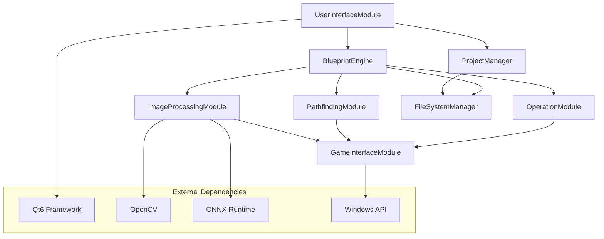

# Components

## BlueprintEngine

**Responsibility:** 蓝图脚本的解析、编译和执行引擎，系统的核心计算模块

**Key Interfaces:**
- executeGraph(BlueprintGraph): ExecutionResult
- validateGraph(BlueprintGraph): ValidationResult
- pauseExecution(): void
- resumeExecution(): void

**Dependencies:** ImageProcessingModule, PathfindingModule, OperationModule

**Technology Stack:** C++20 协程、自定义虚拟机、Qt信号槽系统

## ImageProcessingModule

**Responsibility:** 游戏画面截取、图像预处理、AI模型推理和结果分析

**Key Interfaces:**
- captureGameScreen(WindowHandle): Image
- processImage(Image, RecognitionConfig): RecognitionResult
- loadModel(ModelPath): ModelHandle
- batchProcess(vector<Image>): vector<RecognitionResult>

**Dependencies:** GameInterfaceModule, ONNX Runtime, OpenCV

**Technology Stack:** OpenCV 4.8+、ONNX Runtime、TensorRT GPU加速

## PathfindingModule

**Responsibility:** 路径规划算法、地图数据管理和寻路结果计算

**Key Interfaces:**
- calculatePath(start, end, map): PathResult
- updateMap(MapData): void
- optimizePath(Path): OptimizedPath
- validatePath(Path, Map): ValidationResult

**Dependencies:** CGAL几何库、Boost.Geometry

**Technology Stack:** A*算法、JPS跳点搜索、分层寻路、CGAL计算几何

## GameInterfaceModule

**Responsibility:** 与游戏进程交互，包括窗口管理、截图捕获和操作模拟

**Key Interfaces:**
- findGameWindow(ProcessName): WindowHandle
- captureWindow(WindowHandle): Image
- simulateMouseClick(Point): void
- simulateKeyPress(KeyCode): void

**Dependencies:** Windows API、DirectX/OpenGL hooks

**Technology Stack:** Win32 API、DirectX截图、输入模拟、进程管理

## UserInterfaceModule

**Responsibility:** Qt6 GUI界面、用户交互处理和视觉反馈系统

**Key Interfaces:**
- createBlueprintEditor(): EditorWidget
- updateNodeStatus(NodeId, Status): void
- showExecutionProgress(Progress): void
- handleUserInput(InputEvent): void

**Dependencies:** Qt6 Widgets、Graphics View Framework

**Technology Stack:** Qt6.6+、QML、自定义Widget、GPU渲染优化

## Component Diagrams

