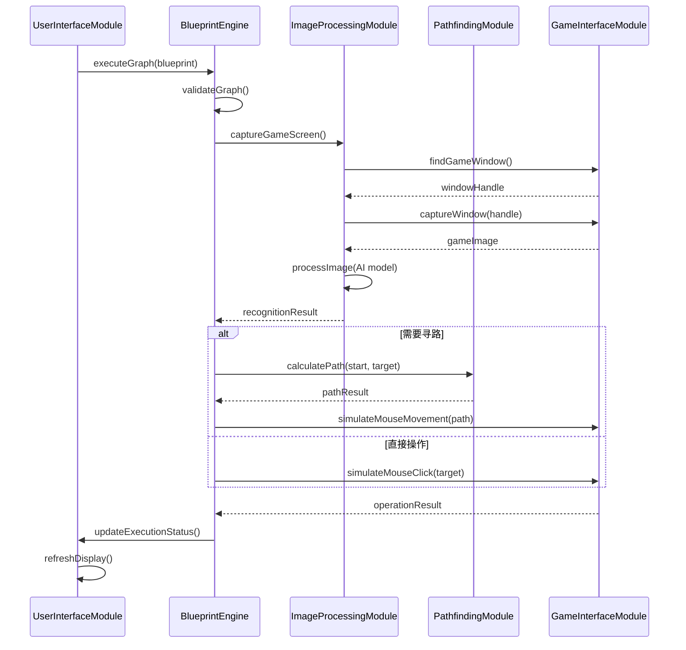
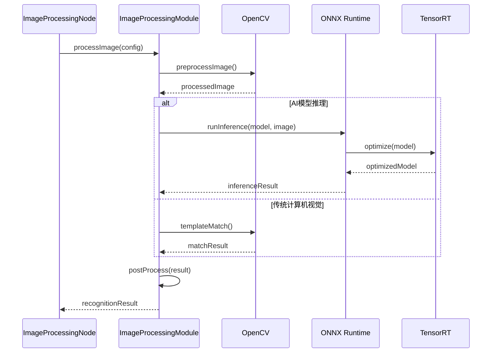

# Core Workflows

## 蓝图脚本执行流程

```mermaid
sequenceDiagram
    participant UI as UserInterfaceModule
    participant BE as BlueprintEngine
    participant IP as ImageProcessingModule
    participant PF as PathfindingModule
    participant GI as GameInterfaceModule
    
    UI->>BE: executeGraph(blueprint)
    BE->>BE: validateGraph()
    BE->>IP: captureGameScreen()
    IP->>GI: findGameWindow()
    GI-->>IP: windowHandle
    IP->>GI: captureWindow(handle)
    GI-->>IP: gameImage
    IP->>IP: processImage(AI model)
    IP-->>BE: recognitionResult
    
    alt 需要寻路
        BE->>PF: calculatePath(start, target)
        PF-->>BE: pathResult
        BE->>GI: simulateMouseMovement(path)
    else 直接操作
        BE->>GI: simulateMouseClick(target)
    end
    
    GI-->>BE: operationResult
    BE->>UI: updateExecutionStatus()
    UI->>UI: refreshDisplay()
```

## 图像识别处理流程

```mermaid
sequenceDiagram
    participant Node as ImageProcessingNode
    participant Module as ImageProcessingModule
    participant OpenCV as OpenCV
    participant ONNX as ONNX Runtime
    participant GPU as TensorRT
    
    Node->>Module: processImage(config)
    Module->>OpenCV: preprocessImage()
    OpenCV-->>Module: processedImage
    
    alt AI模型推理
        Module->>ONNX: runInference(model, image)
        ONNX->>GPU: optimize(model)
        GPU-->>ONNX: optimizedModel
        ONNX-->>Module: inferenceResult
    else 传统计算机视觉
        Module->>OpenCV: templateMatch()
        OpenCV-->>Module: matchResult
    end
    
    Module->>Module: postProcess(result)
    Module-->>Node: recognitionResult
```
