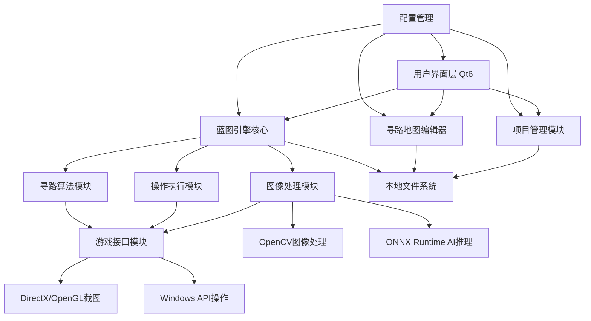

# High Level Architecture

## Technical Summary

本系统采用模块化单体架构设计，基于C++20和Qt6框架构建高性能Windows桌面应用程序。核心架构包含五个主要模块：蓝图引擎、图像处理、寻路算法、UI交互和游戏接口。系统通过事件驱动的消息传递机制实现模块间通信，采用插件化设计支持功能扩展。整体架构支持PRD目标：100-500节点蓝图编辑、≤100ms执行延迟、≤200ms图像处理，为游戏脚本开发提供专业级的可视化编程环境。

## High Level Overview

**主要架构风格：** 模块化单体架构 - 选择单体架构因为游戏脚本需要极低延迟，避免网络开销；采用模块化设计确保代码可维护性和功能扩展性。

**仓库结构决策：** 单一代码仓库管理整个项目，便于代码共享、依赖管理和协调开发。

**服务架构决策：** C++模块化单体架构 + Qt6 GUI框架，核心模块包括：蓝图引擎模块、图像处理模块、寻路算法模块、UI交互模块、游戏接口模块。

**主要用户交互流程：** 用户通过Qt6 GUI创建蓝图 → 蓝图引擎解析执行 → 图像处理模块截取游戏画面 → AI推理识别目标 → 操作执行模块模拟用户输入 → 寻路模块计算移动路径 → 实时反馈显示执行状态。

**关键架构决策：**
- 选择Qt6的Graphics View Framework优化大量节点的渲染性能
- 采用ONNX Runtime支持多种AI模型，提升图像识别准确率
- 使用Intel TBB并行计算框架，充分利用多核CPU资源
- 实现自定义内存池分配器，减少频繁内存分配开销

## High Level Project Diagram

## Architectural and Design Patterns

**模块化单体模式：** 将应用程序组织为松耦合的功能模块，每个模块负责特定的业务领域 - _理由：_ 平衡开发效率与系统性能，便于团队协作开发

**事件驱动架构：** 使用Qt的信号槽机制实现模块间异步通信 - _理由：_ 提升系统响应性，支持并行处理，降低模块间耦合度

**插件架构模式：** 节点类型和算法实现采用插件化设计 - _理由：_ 支持功能扩展，便于第三方开发者贡献新节点类型

**观察者模式：** 蓝图执行状态通过观察者模式通知UI更新 - _理由：_ 实现执行引擎与UI的解耦，支持多种显示形式

**工厂模式：** 节点创建和AI模型加载使用工厂模式 - _理由：_ 简化对象创建，支持动态类型选择和配置

**内存池模式：** 高频分配的对象使用内存池管理 - _理由：_ 减少内存分配开销，提升实时性能，避免内存碎片
