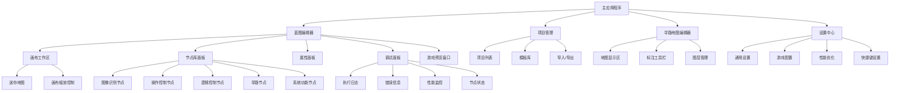
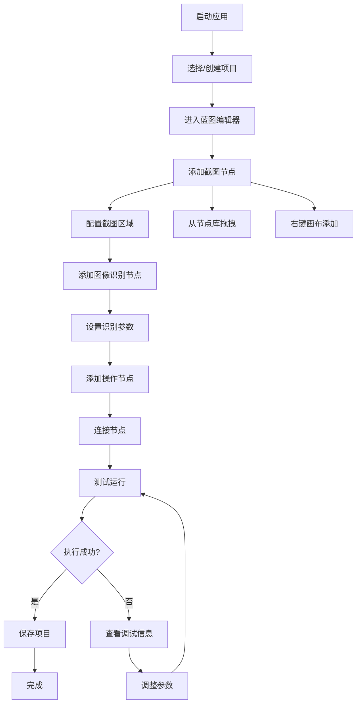
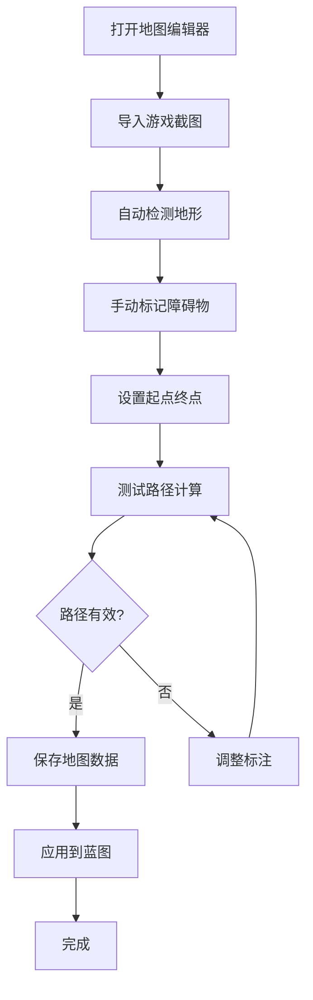

# 无限蓝图游戏脚本开发框架 UI/UX Specification

## Introduction

本文档定义了"无限蓝图游戏脚本开发框架"用户界面的用户体验目标、信息架构、用户流程和视觉设计规格。它作为视觉设计和前端开发的基础，确保提供一致且以用户为中心的体验。

### Overall UX Goals & Principles

#### Target User Personas

**游戏脚本开发者（主要用户）**：个人游戏玩家和小团队，希望创建自动化脚本但缺乏深度编程知识。他们需要直观的可视化工具，能够快速理解和使用。

**进阶脚本制作者**：有一定技术基础的用户，追求高效的工作流程和强大的功能。他们需要快捷键、高级功能和精细控制。

#### Usability Goals

- **快速上手**：新用户能在15分钟内创建第一个工作脚本（PRD目标）
- **操作高效**：熟练用户完成常见任务的点击次数≤5次
- **错误预防**：通过视觉反馈和智能提示避免常见错误
- **记忆友好**：不常用用户重新使用时能快速回忆起操作方式

#### Design Principles

1. **直观优于复杂** - 选择清晰的视觉表达而非复杂的功能堆砌
2. **渐进式揭示** - 根据用户熟练度逐步显示高级功能
3. **即时反馈** - 每个操作都要有清晰的视觉和状态反馈
4. **专业工具感** - 外观和体验要符合用户对专业开发工具的期望
5. **操作可撤销** - 所有操作支持撤销/重做，降低用户心理负担

#### Change Log

| Date | Version | Description | Author |
|------|---------|-------------|--------|
| 2025-08-23 | 1.0 | 初始UI/UX规格创建，基于PRD v1.0 | UX Expert |

## Information Architecture (IA)

### Site Map / Screen Inventory

### Navigation Structure

**Primary Navigation:** 顶部菜单栏 - 文件、编辑、视图、工具、帮助的经典专业软件布局

**Secondary Navigation:** 左侧可折叠侧边栏 - 项目文件树、节点库、属性面板的垂直堆叠

**Breadcrumb Strategy:** 底部可停靠面板区域 - 调试日志、执行状态、性能监控的标签页切换

## User Flows

### 蓝图脚本创建流程

**User Goal:** 创建一个完整的游戏脚本蓝图

**Entry Points:** 主界面"新建项目"按钮、文件菜单"新建"、快捷键Ctrl+N

**Success Criteria:** 用户成功创建、连接节点并运行脚本，看到预期的游戏操作结果

#### Flow Diagram

#### Edge Cases & Error Handling:
- 目标游戏窗口未找到 - 显示游戏检测引导
- 图像识别失败 - 提供参数调整建议和示例
- 节点连接类型不匹配 - 高亮兼容的输入/输出端口
- 脚本执行超时 - 显示超时警告和性能优化建议

**Notes:** 整个流程设计考虑15分钟完成目标，重点优化新手用户的引导和错误恢复

### 寻路地图标注流程

**User Goal:** 为游戏创建可用的寻路地图数据

**Entry Points:** 蓝图编辑器中的寻路节点配置、独立地图编辑器

**Success Criteria:** 完成地图标注，寻路算法能够成功计算路径

#### Flow Diagram

#### Edge Cases & Error Handling:
- 图像导入失败 - 支持多种格式和大小调整
- 自动检测不准确 - 提供手动修正工具
- 路径计算失败 - 显示问题区域高亮和修复建议
- 地图数据过大 - 自动优化和分块处理

**Notes:** 考虑到手动标注的复杂性，提供智能辅助工具和预设模板

## Wireframes & Mockups

**Primary Design Files:** 将使用 Figma 进行详细的视觉设计，设计文件将在项目启动后创建并链接到此文档

### Key Screen Layouts

#### 主蓝图编辑界面

**Purpose:** 提供核心的可视化脚本编辑工作环境，这是用户使用频率最高的界面

**Key Elements:**
- 占80%屏幕的中央画布区域，支持无限滚动和缩放
- 左侧节点库面板，分类展示所有可用节点类型
- 右侧属性面板，显示选中节点的详细配置选项
- 底部调试信息面板，可收起/展开显示执行状态
- 顶部工具栏，包含常用操作按钮和项目信息

**Interaction Notes:** 画布支持鼠标中键拖拽平移，滚轮缩放，框选多个节点。节点支持拖拽移动，双击编辑，右键菜单操作

**Design File Reference:** 待创建 - /designs/main-editor-layout.fig

#### 寻路地图编辑器

**Purpose:** 专门用于创建和编辑游戏寻路地图数据的工具界面

**Key Elements:**
- 中央地图显示区域，显示游戏截图和标注叠加层
- 左侧工具面板，提供画笔、橡皮、区域选择等标注工具
- 右侧图层面板，管理地形、障碍、路径等不同图层
- 底部缩略图导航条，支持大地图的快速定位

**Interaction Notes:** 支持精确的像素级标注，多层级的撤销重做，实时路径预览计算

**Design File Reference:** 待创建 - /designs/pathfinding-editor.fig

#### 游戏预览窗口

**Purpose:** 实时显示脚本在目标游戏中的执行效果，提供直观的反馈

**Key Elements:**
- 游戏画面捕获显示区域
- 半透明叠加层显示操作位置、识别区域、路径轨迹
- 控制按钮：暂停/继续、步进执行、停止脚本
- 状态指示器显示当前执行的节点和进度

**Interaction Notes:** 窗口可独立拖拽到第二显示器，支持置顶显示，叠加信息可切换显示/隐藏

**Design File Reference:** 待创建 - /designs/game-preview-overlay.fig

## Component Library / Design System

**Design System Approach:** 创建"GameDev Pro"设计系统 - 专门为游戏开发工具设计的组件库，结合专业性与游戏元素，确保界面既现代又符合目标用户的审美期望

### Core Components

#### 蓝图节点组件

**Purpose:** 可视化蓝图编辑器的核心交互元素，承载所有脚本逻辑

**Variants:** 
- 图像处理节点（绿色主题）
- 逻辑控制节点（蓝色主题）
- 操作执行节点（橙色主题）
- 寻路导航节点（紫色主题）
- 系统功能节点（灰色主题）

**States:** 
- 默认状态、悬停状态、选中状态、执行中状态、错误状态、禁用状态

**Usage Guidelines:** 节点具有圆角矩形外观，左右两侧有输入输出端口，支持备注图标显示，颜色编码区分功能类别

#### 连接线组件

**Purpose:** 连接蓝图节点，表示数据流和执行顺序

**Variants:**
- 数据连接线（实线）
- 执行连接线（粗实线）
- 条件连接线（虚线）

**States:**
- 正常连接、高亮连接、错误连接、临时连接（拖拽中）

**Usage Guidelines:** 使用贝塞尔曲线，不同数据类型用不同颜色，支持动画效果显示数据流向

#### 工具面板组件

**Purpose:** 容纳各种工具和控制元素的可停靠面板

**Variants:**
- 节点库面板、属性面板、调试面板、项目面板

**States:**
- 展开状态、折叠状态、浮动状态、停靠状态

**Usage Guidelines:** 统一的标题栏设计，支持拖拽重新排列，保持视觉一致性

## Branding & Style Guide

**Brand Guidelines:** 无限蓝图品牌将体现"专业 + 易用 + 创新"的核心价值，视觉语言融合科技感与游戏元素

### Color Palette

| Color Type | Hex Code | Usage |
|------------|----------|--------|
| Primary | #007ACC | 主要交互元素、品牌色、重要按钮 |
| Secondary | #4A90E2 | 次级交互元素、链接、辅助信息 |
| Accent | #FF6B35 | 强调色、警告提示、执行状态 |
| Success | #28A745 | 成功状态、确认操作、正常运行状态 |
| Warning | #FFC107 | 警告信息、需要注意的操作 |
| Error | #DC3545 | 错误状态、失败操作、危险按钮 |
| Neutral | #2D2D2D, #404040, #666666, #CCCCCC | 背景、边框、文本、界面元素 |

### Typography

#### Font Families
- **Primary:** "Segoe UI", "Microsoft YaHei", sans-serif
- **Secondary:** "Segoe UI Semibold" for headings
- **Monospace:** "Consolas", "Monaco", monospace

#### Type Scale

| Element | Size | Weight | Line Height |
|---------|------|--------|-------------|
| H1 | 24px | 600 | 1.3 |
| H2 | 20px | 600 | 1.4 |
| H3 | 16px | 600 | 1.4 |
| Body | 14px | 400 | 1.5 |
| Small | 12px | 400 | 1.4 |

### Iconography

**Icon Library:** 使用 Feather Icons 作为基础图标库，配合自定义的节点类型图标

**Usage Guidelines:** 所有图标采用线性风格，统一的2px描边，支持多种尺寸（16px、20px、24px），确保在深色背景下的可读性

### Spacing & Layout

**Grid System:** 基于8px基础单位的设计系统，所有间距和尺寸都是8的倍数

**Spacing Scale:** 4px, 8px, 16px, 24px, 32px, 48px, 64px

## Accessibility Requirements

**Standard:** WCAG AA 2.1 合规，确保所有用户都能有效使用这个专业开发工具

### Key Requirements

**Visual:**
- Color contrast ratios: 所有文本与背景对比度≥4.5:1，大文本≥3:1
- Focus indicators: 所有可交互元素具有清晰的2px蓝色焦点环
- Text sizing: 支持200%缩放而不丢失功能，最小字体12px

**Interaction:**
- Keyboard navigation: 全功能键盘操作支持，Tab键逻辑顺序，快捷键支持
- Screen reader support: 所有UI元素提供适当的ARIA标签和语义化标记
- Touch targets: 最小点击目标44px×44px，适当的间距避免误触

**Content:**
- Alternative text: 所有图标和图像提供描述性替代文本
- Heading structure: 使用正确的标题层级（H1-H6）构建信息层次
- Form labels: 所有表单控件关联明确的标签，提供输入指导

### Testing Strategy

使用自动化工具（axe-core）+ 手动测试 + 真实用户测试的三层验证方法，确保可访问性标准的实际达成

## Responsiveness Strategy

基于PRD中"Desktop Only"的明确要求，我设计了桌面环境优化的响应策略：

### Breakpoints

| Breakpoint | Min Width | Max Width | Target Devices |
|------------|-----------|-----------|----------------|
| Small Desktop | 1366px | 1599px | 小屏笔记本、老式显示器 |
| Standard Desktop | 1600px | 1919px | 标准桌面显示器 |
| Large Desktop | 1920px | 2559px | 高分辨率显示器 |
| Ultra Wide | 2560px | - | 4K显示器、超宽屏 |

### Adaptation Patterns

**Layout Changes:** 面板宽度自适应调整，画布区域优先扩展，工具栏图标密度根据屏幕尺寸调整

**Navigation Changes:** 大屏幕显示完整菜单文本，小屏幕使用图标+工具提示，保持功能完整性

**Content Priority:** 核心蓝图编辑区域始终保持80%屏幕占用，辅助面板根据屏幕空间动态调整

**Interaction Changes:** 高DPI屏幕优化触控操作，标准屏幕专注鼠标操作精度

## Animation & Micro-interactions

### Motion Principles

遵循"有意义的动画"原则 - 每个动画都服务于功能目的，提升用户理解而非装饰效果。优先考虑性能，确保60fps流畅体验

### Key Animations

- **节点连接动画:** 贝塞尔曲线绘制过程 (Duration: 200ms, Easing: ease-out)
- **面板展开收起:** 平滑的宽度/高度变化 (Duration: 300ms, Easing: ease-in-out)  
- **节点状态变化:** 颜色和阴影渐变 (Duration: 150ms, Easing: ease-out)
- **执行流程指示:** 沿连接线的流动效果 (Duration: 1000ms, Easing: linear)
- **错误状态提醒:** 轻微震动效果 (Duration: 300ms, Easing: bounce)

## Performance Considerations

### Performance Goals

- **应用启动:** ≤5秒（符合PRD要求）
- **界面响应:** ≤100ms（符合PRD要求）
- **动画帧率:** 60fps恒定帧率

### Design Strategies

采用虚拟化渲染技术处理大量节点，使用LOD（细节层次）系统在不同缩放级别显示不同的节点详细度，实施智能缓存策略减少重复渲染，优先使用GPU加速的CSS变换和Canvas绘制

## Checklist Results

UI/UX规格文档已完成全部核心章节，涵盖了从用户需求到具体实现的完整设计框架。文档基于PRD的MVP优化方案，重点关注实用性和开发可行性，为后续的视觉设计和前端开发提供了清晰的指导。