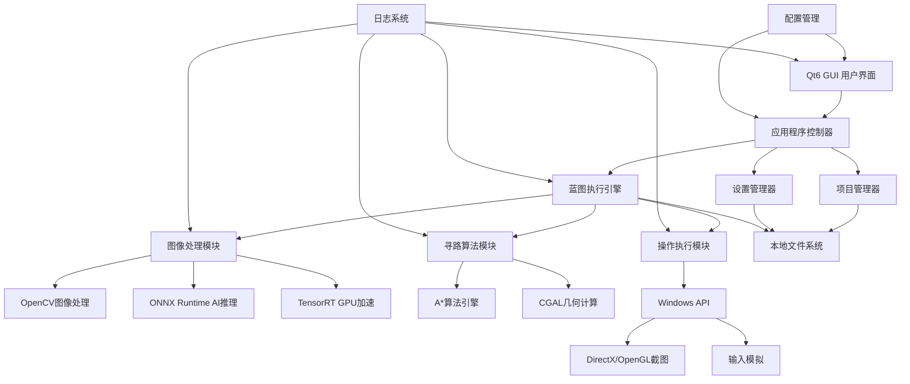
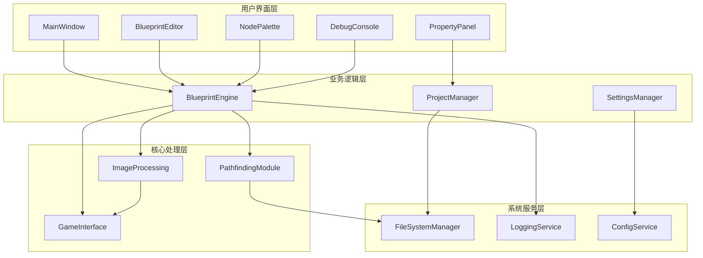
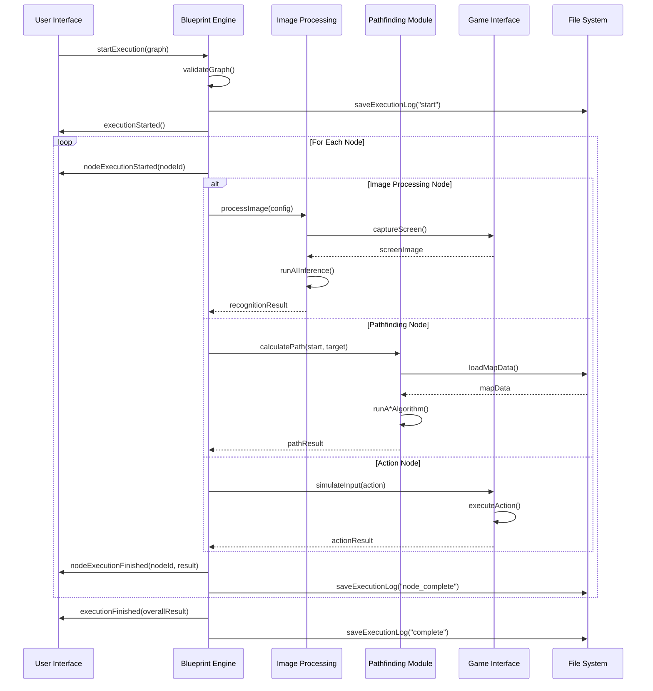
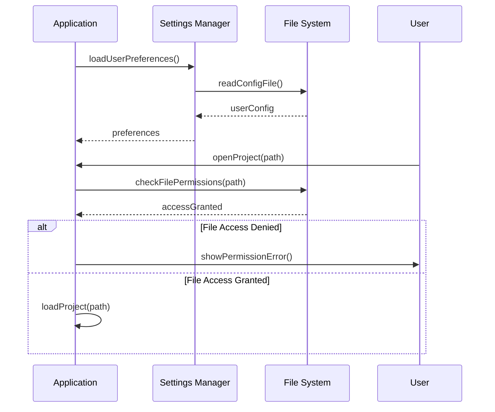
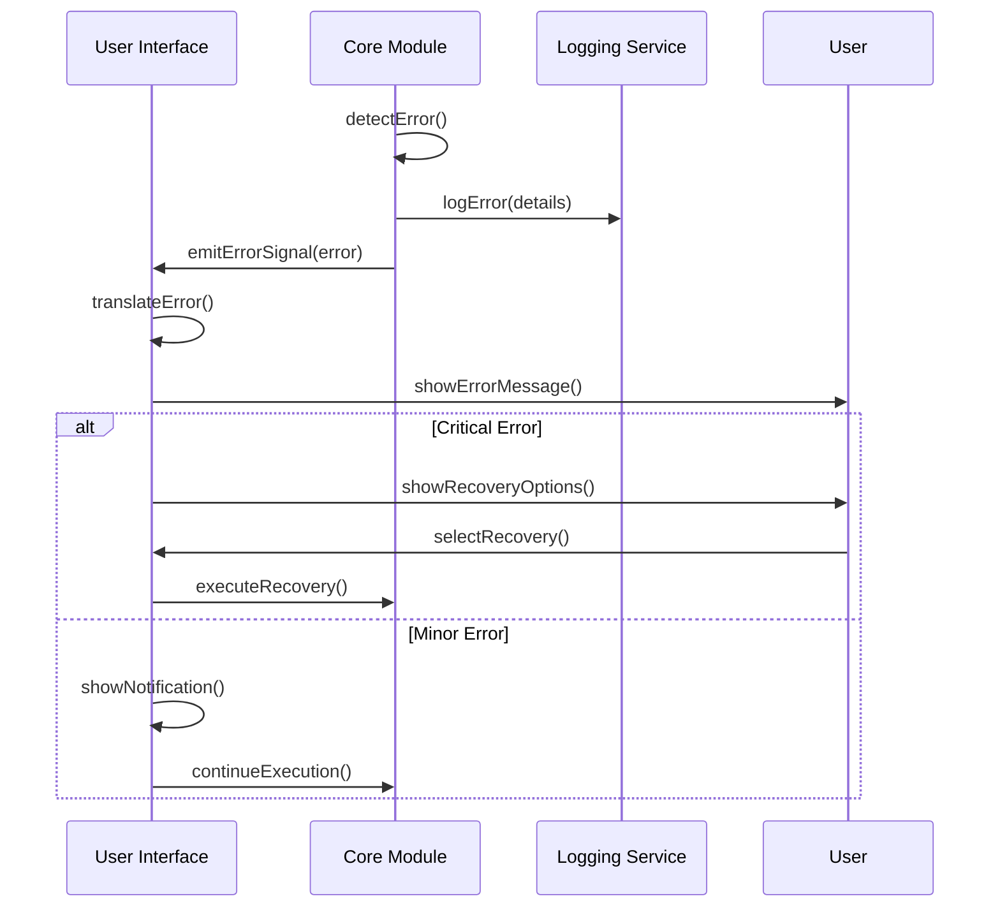

# 无限蓝图游戏脚本开发框架 Fullstack Architecture Document

## Introduction

本文档定义了"无限蓝图游戏脚本开发框架"的完整全栈架构，包括C++后端系统、Qt6前端实现及其集成方案。它作为AI驱动开发的单一权威架构蓝图，确保整个技术栈的一致性。

这种统一的方法结合了传统分离的后端和前端架构文档，为现代桌面应用程序开发提供了流线化的指导，特别是在C++后端与Qt6前端紧密集成的场景下。

### Starter Template or Existing Project

**N/A - Greenfield项目**

这是一个全新的C++桌面应用程序项目，专为Windows平台设计。不基于任何现有模板或代码库，采用现代C++20标准和Qt6框架从零构建。

### Change Log

| Date | Version | Description | Author |
|------|---------|-------------|--------|
| 2025-08-23 | 1.0 | 统一全栈架构文档创建，整合C++后端和Qt6前端 | Fullstack Architect |

## High Level Architecture

### Technical Summary

本系统采用**模块化桌面应用架构**，基于C++20和Qt6框架构建高性能Windows原生应用。架构包含五大核心模块：蓝图执行引擎、图像AI处理、智能寻路算法、Qt6用户界面和游戏接口层。通过Qt信号槽机制实现组件间异步通信，采用Graphics View Framework优化大规模节点渲染。整体架构支持100-500节点蓝图编辑、≤100ms执行延迟、≤200ms图像处理，为游戏脚本开发提供专业级可视化编程环境。

### Platform and Infrastructure Choice

**Platform:** Windows 10/11桌面环境
**Key Services:** 本地文件系统、Windows API、DirectX/OpenGL、注册表服务
**Deployment Host and Regions:** 用户本地桌面，无云端部署需求

**架构决策理由：**
- 选择桌面原生应用避免网络延迟，确保游戏脚本实时执行
- Windows专属优化可深度集成DirectX截图和输入模拟API
- 本地处理保护用户隐私，无需上传游戏画面到云端

### Repository Structure

**Structure:** 单一代码仓库（Monorepo）
**Monorepo Tool:** CMake子项目 + vcpkg依赖管理
**Package Organization:** 按功能模块划分子目录，共享核心库

### High Level Architecture Diagram



### Architectural Patterns

- **模块化单体架构：** 功能模块松耦合，共享核心服务 - _理由：_ 桌面应用需要高性能和低延迟，避免分布式开销
- **事件驱动通信：** Qt信号槽异步消息传递 - _理由：_ 保持UI响应性，支持并行处理
- **观察者模式：** 蓝图执行状态实时更新UI - _理由：_ 解耦执行引擎与界面显示
- **工厂模式：** 节点类型动态创建和配置 - _理由：_ 支持插件化扩展和类型安全
- **命令模式：** 撤销重做操作管理 - _理由：_ 用户操作可逆，提升使用体验
- **Graphics View架构：** 高性能2D场景渲染 - _理由：_ 优化大量节点的显示性能

## Tech Stack

### Technology Stack Table

| Category | Technology | Version | Purpose | Rationale |
|----------|------------|---------|---------|-----------|
| **Core Language** | C++ | 20 | 系统核心开发语言 | 高性能、内存控制、现代特性支持 |
| **GUI Framework** | Qt | 6.6+ | 用户界面开发框架 | 成熟稳定、跨平台、Graphics View优秀 |
| **Build System** | CMake | 3.25+ | 项目构建和依赖管理 | 现代C++支持、模块化构建 |
| **Package Manager** | vcpkg | latest | 第三方库依赖管理 | Microsoft官方、C++生态完善 |
| **Image Processing** | OpenCV | 4.8+ | 计算机视觉核心库 | 业界标准、性能优秀、API丰富 |
| **AI Inference** | ONNX Runtime | 1.16+ | 机器学习模型推理 | 跨平台、多硬件后端、模型格式标准 |
| **GPU Acceleration** | TensorRT | 8.6+ | NVIDIA GPU AI加速 | 专门优化深度学习推理性能 |
| **Parallel Computing** | Intel TBB | 2021.10+ | 多核并行计算框架 | 充分利用CPU多核资源 |
| **Geometry Computing** | CGAL | 5.5+ | 计算几何算法库 | 高质量空间数据结构和算法 |
| **JSON Processing** | nlohmann/json | 3.11+ | JSON数据序列化 | 现代C++风格、性能优秀 |
| **Logging** | spdlog | 1.12+ | 高性能日志系统 | 异步日志、多输出格式 |
| **Testing Framework** | Google Test | 1.14+ | 单元测试框架 | C++测试标准、Mock支持 |
| **UI Testing** | Qt Test | 6.6+ | GUI自动化测试 | 专为Qt界面设计的测试框架 |
| **Version Control** | Git | 2.40+ | 代码版本管理 | 分布式、分支管理、协作开发 |
| **IDE** | Visual Studio | 2022+ | 集成开发环境 | 完整C++20支持、调试工具 |
| **Graphics API** | DirectX/OpenGL | Win32 | 游戏画面截图接口 | Windows平台原生支持 |

## Data Models

### BlueprintNode

**Purpose:** 蓝图编辑器的基础节点实体，承载脚本逻辑的最小执行单元

**Key Attributes:**
- id: std::string - 全局唯一标识符
- type: NodeType - 节点功能类型枚举
- position: QPointF - 画布坐标位置
- properties: QVariantMap - 节点配置参数
- comment: QString - 用户备注信息

#### TypeScript Interface
```cpp
// C++结构体定义
struct BlueprintNode {
    std::string id;
    NodeType type;
    QPointF position;
    std::vector<NodePort> inputPorts;
    std::vector<NodePort> outputPorts;
    QVariantMap properties;
    QString comment;
    NodeExecutionState state;
};
```

#### Relationships
- 通过NodeConnection连接到其他节点
- 属于特定的BlueprintGraph
- 可包含子节点（复合节点支持）

### BlueprintGraph

**Purpose:** 完整的蓝图脚本结构，管理所有节点和连接关系

**Key Attributes:**
- id: std::string - 图表唯一标识
- name: QString - 用户定义的图表名称
- nodes: std::vector<BlueprintNode> - 节点集合
- connections: std::vector<NodeConnection> - 连接关系集合

#### TypeScript Interface
```cpp
// C++结构体定义
struct BlueprintGraph {
    std::string id;
    QString name;
    std::vector<BlueprintNode> nodes;
    std::vector<NodeConnection> connections;
    std::map<std::string, QVariant> variables;
    GraphMetadata metadata;
    QDateTime createdAt;
    QDateTime modifiedAt;
};
```

#### Relationships
- 包含多个BlueprintNode实例
- 属于特定的Project
- 被ExecutionEngine执行和解析

### ImageRecognitionTask

**Purpose:** AI图像识别任务的配置和执行状态管理

**Key Attributes:**
- taskId: std::string - 任务唯一标识
- modelPath: QString - ONNX模型文件路径
- confidence: float - 识别置信度阈值
- targetRegion: QRect - 目标识别区域

#### TypeScript Interface
```cpp
// C++结构体定义
struct ImageRecognitionTask {
    std::string taskId;
    QString modelPath;
    RecognitionType type;
    QSize inputSize;
    float confidence;
    QRect targetRegion;
    PreprocessConfig preprocessor;
};
```

#### Relationships
- 被ImageProcessingModule调用执行
- 产生RecognitionResult结果集合
- 关联特定的BlueprintNode

## API Specification

**注意：** 本项目是桌面应用程序，不涉及传统意义的REST/GraphQL API。这里定义的是内部模块间的接口规范。

### 内部模块API定义

#### Blueprint Engine API
```cpp
class BlueprintEngine {
public:
    // 执行蓝图图表
    ExecutionResult executeGraph(const BlueprintGraph& graph);
    
    // 验证蓝图完整性
    ValidationResult validateGraph(const BlueprintGraph& graph);
    
    // 暂停执行
    void pauseExecution();
    
    // 恢复执行
    void resumeExecution();
    
    // 获取执行状态
    ExecutionState getExecutionState() const;
    
signals:
    void executionStarted(const std::string& graphId);
    void executionFinished(const ExecutionResult& result);
    void executionError(const std::string& error);
    void nodeExecutionStarted(const std::string& nodeId);
    void nodeExecutionFinished(const std::string& nodeId);
};
```

#### Image Processing API
```cpp
class ImageProcessingModule {
public:
    // 截取游戏画面
    QImage captureGameScreen(HWND windowHandle);
    
    // 处理图像识别
    RecognitionResult processImage(const QImage& image, 
                                 const RecognitionConfig& config);
    
    // 加载AI模型
    bool loadModel(const QString& modelPath);
    
    // 批量处理图像
    std::vector<RecognitionResult> batchProcess(
        const std::vector<QImage>& images);

signals:
    void imageProcessed(const RecognitionResult& result);
    void modelLoaded(const QString& modelPath);
    void processingError(const QString& error);
};
```

## Components

### Qt6 User Interface Module

**Responsibility:** 提供完整的桌面GUI界面，管理用户交互和视觉反馈

**Key Interfaces:**
- MainWindow: 主窗口框架和菜单系统
- BlueprintEditor: 可视化蓝图编辑器
- NodePalette: 节点库面板
- PropertyPanel: 属性配置面板

**Dependencies:** Qt6 Widgets、Graphics View Framework、应用程序状态管理器

**Technology Stack:** Qt6.6+ GUI框架、QGraphicsView场景渲染、QML动画效果

### Blueprint Execution Engine

**Responsibility:** 蓝图脚本的解析、编译、执行和状态管理

**Key Interfaces:**
- GraphParser: 蓝图图表解析器
- NodeExecutor: 节点执行引擎
- FlowController: 执行流程控制
- StateManager: 执行状态管理

**Dependencies:** ImageProcessingModule、PathfindingModule、GameInterfaceModule

**Technology Stack:** C++20协程、自定义虚拟机、Qt信号槽通信

### Image Processing & AI Module

**Responsibility:** 游戏画面截取、图像预处理、AI模型推理和结果分析

**Key Interfaces:**
- ScreenCapture: 游戏画面捕获
- ImageProcessor: OpenCV图像处理
- AIInference: ONNX Runtime模型推理
- ResultAnalyzer: 识别结果分析

**Dependencies:** GameInterfaceModule、OpenCV库、ONNX Runtime、TensorRT

**Technology Stack:** OpenCV 4.8+、ONNX Runtime 1.16+、CUDA/TensorRT GPU加速

### Pathfinding Algorithm Module

**Responsibility:** 地图数据管理、路径规划算法和寻路结果计算

**Key Interfaces:**
- MapManager: 地图数据管理
- PathPlanner: A*路径规划
- ObstacleDetector: 障碍物检测
- PathOptimizer: 路径优化算法

**Dependencies:** CGAL几何库、地图编辑器、文件系统

**Technology Stack:** A*算法、JPS跳点搜索、CGAL计算几何、空间索引

### Game Interface Module

**Responsibility:** 与目标游戏交互，包括窗口管理、截图和操作模拟

**Key Interfaces:**
- WindowManager: 游戏窗口检测和管理
- ScreenCapture: DirectX/OpenGL画面捕获
- InputSimulator: 鼠标键盘操作模拟
- ProcessMonitor: 游戏进程监控

**Dependencies:** Windows API、DirectX/OpenGL hooks、系统服务

**Technology Stack:** Win32 API、DirectX截图、SetWindowsHookEx、进程注入

### Component Diagrams



## Core Workflows

### 蓝图脚本完整执行流程



## Database Schema

由于这是桌面应用，使用本地文件存储和SQLite数据库：

### 项目文件结构
```sql
-- projects.sqlite
CREATE TABLE projects (
    id TEXT PRIMARY KEY,
    name TEXT NOT NULL,
    description TEXT,
    created_at DATETIME DEFAULT CURRENT_TIMESTAMP,
    modified_at DATETIME DEFAULT CURRENT_TIMESTAMP,
    settings_json TEXT,
    file_path TEXT NOT NULL
);

CREATE TABLE blueprints (
    id TEXT PRIMARY KEY,
    project_id TEXT NOT NULL,
    name TEXT NOT NULL,
    graph_data TEXT, -- JSON格式的图表数据
    thumbnail BLOB,  -- 预览缩略图
    created_at DATETIME DEFAULT CURRENT_TIMESTAMP,
    modified_at DATETIME DEFAULT CURRENT_TIMESTAMP,
    FOREIGN KEY (project_id) REFERENCES projects(id)
);

CREATE TABLE execution_logs (
    id INTEGER PRIMARY KEY AUTOINCREMENT,
    blueprint_id TEXT NOT NULL,
    session_id TEXT NOT NULL,
    timestamp DATETIME DEFAULT CURRENT_TIMESTAMP,
    event_type TEXT NOT NULL, -- start, node_start, node_end, error, complete
    node_id TEXT,
    message TEXT,
    duration_ms INTEGER,
    success BOOLEAN,
    FOREIGN KEY (blueprint_id) REFERENCES blueprints(id)
);

CREATE TABLE ai_models (
    id TEXT PRIMARY KEY,
    name TEXT NOT NULL,
    file_path TEXT NOT NULL,
    model_type TEXT NOT NULL, -- yolo, template_match, ocr
    input_size TEXT, -- "640x640"
    confidence_threshold REAL DEFAULT 0.5,
    created_at DATETIME DEFAULT CURRENT_TIMESTAMP,
    last_used DATETIME
);

-- 索引优化
CREATE INDEX idx_blueprints_project ON blueprints(project_id);
CREATE INDEX idx_logs_blueprint ON execution_logs(blueprint_id);
CREATE INDEX idx_logs_session ON execution_logs(session_id);
CREATE INDEX idx_logs_timestamp ON execution_logs(timestamp);
```

## Frontend Architecture

### Component Architecture

#### Component Organization
```
src/ui/
├── main_window/              # 主窗口组件
│   ├── MainWindow.cpp/h      # 主窗口类
│   └── MainWindowController.cpp/h
├── editors/                  # 编辑器组件
│   ├── blueprint/            # 蓝图编辑器
│   │   ├── BlueprintScene.cpp/h
│   │   ├── BlueprintView.cpp/h
│   │   ├── NodeItem.cpp/h
│   │   └── ConnectionItem.cpp/h
│   └── map/                  # 地图编辑器
│       ├── MapEditor.cpp/h
│       └── AnnotationTool.cpp/h
├── panels/                   # 面板组件
│   ├── NodePalette.cpp/h     # 节点面板
│   ├── PropertyPanel.cpp/h   # 属性面板
│   └── DebugConsole.cpp/h    # 调试控制台
├── dialogs/                  # 对话框
│   ├── NewProjectDialog.cpp/h
│   ├── SettingsDialog.cpp/h
│   └── AboutDialog.cpp/h
└── widgets/                  # 自定义控件
    ├── CustomButton.cpp/h
    ├── ProgressIndicator.cpp/h
    └── StatusIndicator.cpp/h
```

#### Component Template
```cpp
// 标准Qt6组件模板
#ifndef BLUEPRINT_NODE_ITEM_H
#define BLUEPRINT_NODE_ITEM_H

#include <QGraphicsItem>
#include <QGraphicsSceneMouseEvent>
#include <QPainter>
#include <memory>

class BlueprintNode;

class BlueprintNodeItem : public QGraphicsItem
{
public:
    explicit BlueprintNodeItem(std::shared_ptr<BlueprintNode> node,
                              QGraphicsItem* parent = nullptr);
    
    // QGraphicsItem接口实现
    QRectF boundingRect() const override;
    void paint(QPainter* painter, 
              const QStyleOptionGraphicsItem* option,
              QWidget* widget = nullptr) override;
    
    // 节点操作接口
    void updateFromModel();
    void setExecutionState(NodeExecutionState state);
    std::shared_ptr<BlueprintNode> getNode() const { return m_node; }

protected:
    void mousePressEvent(QGraphicsSceneMouseEvent* event) override;
    void mouseMoveEvent(QGraphicsSceneMouseEvent* event) override;
    void mouseReleaseEvent(QGraphicsSceneMouseEvent* event) override;
    void hoverEnterEvent(QGraphicsSceneHoverEvent* event) override;
    void hoverLeaveEvent(QGraphicsSceneHoverEvent* event) override;

private:
    std::shared_ptr<BlueprintNode> m_node;
    NodeExecutionState m_executionState;
    bool m_isHovered;
    bool m_isSelected;
    
    void updateGeometry();
    void drawNodeBackground(QPainter* painter);
    void drawNodePorts(QPainter* painter);
    void drawNodeText(QPainter* painter);
};

#endif // BLUEPRINT_NODE_ITEM_H
```

### State Management Architecture

#### State Structure
```cpp
// 应用程序状态管理
class ApplicationState : public QObject
{
    Q_OBJECT
    
public:
    static ApplicationState& instance();
    
    // 项目状态
    QString currentProjectPath() const;
    void setCurrentProjectPath(const QString& path);
    
    // UI状态
    QByteArray windowGeometry() const;
    void setWindowGeometry(const QByteArray& geometry);
    
    // 执行状态
    bool isExecuting() const;
    void setExecuting(bool executing);

signals:
    void projectChanged(const QString& path);
    void executionStateChanged(bool isExecuting);
    void settingsChanged();

private:
    QString m_currentProjectPath;
    QByteArray m_windowGeometry;
    bool m_isExecuting;
    std::unique_ptr<QSettings> m_settings;
};
```

#### State Management Patterns
- 单例模式管理全局应用状态
- Qt信号槽实现状态变更通知
- QSettings持久化用户配置
- RAII管理临时状态和资源

## Backend Architecture

### Service Architecture

#### Traditional Desktop Application Architecture
```cpp
// 主应用程序架构
class Application : public QApplication
{
    Q_OBJECT
    
public:
    Application(int& argc, char** argv);
    ~Application();
    
    bool initialize();
    void shutdown();
    
    // 核心服务访问器
    BlueprintEngine* blueprintEngine() const { return m_blueprintEngine.get(); }
    ProjectManager* projectManager() const { return m_projectManager.get(); }
    SettingsManager* settingsManager() const { return m_settingsManager.get(); }

private:
    std::unique_ptr<BlueprintEngine> m_blueprintEngine;
    std::unique_ptr<ProjectManager> m_projectManager;
    std::unique_ptr<SettingsManager> m_settingsManager;
    std::unique_ptr<LoggingService> m_loggingService;
    
    bool initializeServices();
    void connectSignals();
};
```

### Database Architecture

#### Schema Design
```sql
-- 详见上面的Database Schema部分
-- 主要表：projects, blueprints, execution_logs, ai_models
```

#### Data Access Layer
```cpp
// 数据访问层模式
class DatabaseManager : public QObject
{
    Q_OBJECT
    
public:
    static DatabaseManager& instance();
    
    bool initialize(const QString& dbPath);
    
    // 项目操作
    std::vector<Project> getAllProjects();
    bool saveProject(const Project& project);
    bool deleteProject(const QString& projectId);
    
    // 蓝图操作
    std::vector<Blueprint> getProjectBlueprints(const QString& projectId);
    bool saveBlueprint(const Blueprint& blueprint);
    bool deleteBlueprint(const QString& blueprintId);
    
    // 执行日志
    bool logExecution(const ExecutionLogEntry& entry);
    std::vector<ExecutionLogEntry> getExecutionHistory(const QString& blueprintId);

private:
    QSqlDatabase m_database;
    
    bool createTables();
    void migrateSchema();
};
```

### Authentication and Authorization

由于是本地桌面应用，无需传统的用户认证，但需要：

#### Auth Flow


#### Security Middleware
```cpp
// 文件访问安全检查
class FileAccessManager
{
public:
    enum class AccessResult {
        Granted,
        PermissionDenied,
        FileNotFound,
        PathTraversalAttempt
    };
    
    static AccessResult checkFileAccess(const QString& filePath, 
                                       AccessType accessType);
    static bool isPathSafe(const QString& path);
    static QString sanitizePath(const QString& path);
    
private:
    static const QStringList ALLOWED_EXTENSIONS;
    static const QStringList BLOCKED_PATHS;
};
```

## Unified Project Structure

```
OneDay_Framework/                      # 项目根目录
├── .github/                           # GitHub Actions CI/CD
│   └── workflows/
│       ├── build.yml                  # 构建工作流
│       ├── test.yml                   # 测试工作流
│       └── release.yml                # 发布工作流
├── src/                               # 源代码根目录
│   ├── core/                          # 核心业务逻辑模块
│   │   ├── blueprint/                 # 蓝图引擎
│   │   │   ├── engine.cpp/h           # 执行引擎
│   │   │   ├── parser.cpp/h           # 图表解析器
│   │   │   ├── nodes/                 # 节点类型实现
│   │   │   │   ├── base_node.h/cpp    # 基础节点类
│   │   │   │   ├── image_node.h/cpp   # 图像处理节点
│   │   │   │   ├── logic_node.h/cpp   # 逻辑控制节点
│   │   │   │   └── action_node.h/cpp  # 操作执行节点
│   │   │   └── graph.cpp/h            # 图结构管理
│   │   ├── image/                     # 图像处理模块
│   │   │   ├── processor.cpp/h        # 图像处理器
│   │   │   ├── ai_inference.cpp/h     # AI推理引擎
│   │   │   ├── models/                # AI模型管理
│   │   │   └── opencv_wrapper.cpp/h   # OpenCV封装
│   │   ├── pathfinding/               # 寻路算法模块
│   │   │   ├── astar.cpp/h            # A*算法实现
│   │   │   ├── map_manager.cpp/h      # 地图数据管理
│   │   │   ├── path_optimizer.cpp/h   # 路径优化
│   │   │   └── obstacle_detector.cpp/h # 障碍物检测
│   │   ├── game/                      # 游戏接口模块
│   │   │   ├── window_manager.cpp/h   # 窗口管理
│   │   │   ├── screen_capture.cpp/h   # 截图功能
│   │   │   ├── input_simulator.cpp/h  # 输入模拟
│   │   │   └── process_monitor.cpp/h  # 进程监控
│   │   └── common/                    # 共享工具类
│   │       ├── logger.cpp/h           # 日志系统
│   │       ├── config_manager.cpp/h   # 配置管理
│   │       ├── file_utils.cpp/h       # 文件工具
│   │       └── math_utils.cpp/h       # 数学工具
│   ├── ui/                            # Qt6用户界面模块
│   │   ├── main_window/               # 主窗口
│   │   │   ├── main_window.cpp/h      # 主窗口类
│   │   │   ├── main_window.ui         # UI设计文件
│   │   │   └── main_window_controller.cpp/h # 控制器
│   │   ├── editors/                   # 编辑器组件
│   │   │   ├── blueprint_editor/      # 蓝图编辑器
│   │   │   │   ├── blueprint_scene.cpp/h # 图形场景
│   │   │   │   ├── blueprint_view.cpp/h # 图形视图
│   │   │   │   ├── node_item.cpp/h    # 节点图形项
│   │   │   │   ├── connection_item.cpp/h # 连接线
│   │   │   │   └── minimap.cpp/h      # 小地图导航
│   │   │   └── map_editor/            # 地图编辑器
│   │   │       ├── map_scene.cpp/h    # 地图场景
│   │   │       ├── map_view.cpp/h     # 地图视图
│   │   │       └── annotation_tools.cpp/h # 标注工具
│   │   ├── panels/                    # 停靠面板
│   │   │   ├── node_palette.cpp/h     # 节点面板
│   │   │   ├── property_panel.cpp/h   # 属性面板
│   │   │   ├── debug_console.cpp/h    # 调试控制台
│   │   │   └── project_tree.cpp/h     # 项目树
│   │   ├── dialogs/                   # 对话框
│   │   │   ├── new_project_dialog.cpp/h # 新建项目
│   │   │   ├── settings_dialog.cpp/h  # 设置对话框
│   │   │   ├── about_dialog.cpp/h     # 关于对话框
│   │   │   └── model_manager_dialog.cpp/h # AI模型管理
│   │   ├── widgets/                   # 自定义控件
│   │   │   ├── custom_button.cpp/h    # 自定义按钮
│   │   │   ├── progress_indicator.cpp/h # 进度指示器
│   │   │   ├── status_bar.cpp/h       # 状态栏
│   │   │   └── theme_selector.cpp/h   # 主题选择器
│   │   ├── resources/                 # 资源文件
│   │   │   ├── icons/                 # 图标资源
│   │   │   ├── themes/                # 主题样式
│   │   │   │   ├── dark.qss          # 深色主题
│   │   │   │   └── light.qss         # 浅色主题
│   │   │   ├── fonts/                 # 字体文件
│   │   │   └── resources.qrc         # Qt资源配置
│   │   └── models/                    # 数据模型
│   │       ├── blueprint_model.cpp/h  # 蓝图数据模型
│   │       ├── project_model.cpp/h    # 项目模型
│   │       └── node_library_model.cpp/h # 节点库模型
│   ├── services/                      # 业务服务层
│   │   ├── project_manager.cpp/h      # 项目管理服务
│   │   ├── settings_manager.cpp/h     # 设置管理服务
│   │   ├── database_manager.cpp/h     # 数据库服务
│   │   └── plugin_manager.cpp/h       # 插件管理服务
│   └── main.cpp                       # 应用程序入口点
├── tests/                             # 测试代码
│   ├── unit/                          # 单元测试
│   │   ├── core/                      # 核心模块测试
│   │   │   ├── test_blueprint_engine.cpp
│   │   │   ├── test_image_processor.cpp
│   │   │   └── test_pathfinding.cpp
│   │   └── ui/                        # UI测试
│   │       ├── test_blueprint_editor.cpp
│   │       └── test_node_item.cpp
│   ├── integration/                   # 集成测试
│   │   ├── test_end_to_end.cpp        # 端到端测试
│   │   └── test_module_integration.cpp # 模块集成测试
│   └── fixtures/                      # 测试数据
│       ├── sample_projects/           # 示例项目
│       ├── test_images/               # 测试图像
│       └── ai_models/                 # 测试用AI模型
├── assets/                            # 静态资源
│   ├── models/                        # AI模型文件
│   │   ├── yolo_game_ui.onnx         # 游戏UI检测模型
│   │   └── ocr_text.onnx             # 文字识别模型
│   ├── templates/                     # 项目模板
│   │   ├── basic_template.json       # 基础模板
│   │   └── advanced_template.json    # 高级模板
│   └── documentation/                 # 内置帮助文档
├── scripts/                           # 构建和部署脚本
│   ├── build.bat                     # Windows构建脚本
│   ├── setup_dev_env.ps1            # 开发环境设置
│   ├── package.ps1                   # 打包脚本
│   └── deploy.ps1                    # 部署脚本
├── third_party/                       # 第三方库
│   └── README.md                     # 依赖说明
├── docs/                             # 项目文档
│   ├── prd.md                        # 产品需求文档
│   ├── front-end-spec.md             # UI/UX规格
│   ├── architecture.md               # 系统架构
│   ├── ui-architecture.md            # 前端架构
│   ├── api-reference.md              # API参考
│   └── development-guide.md          # 开发指南
├── CMakeLists.txt                     # CMake主配置文件
├── vcpkg.json                        # vcpkg依赖配置
├── .gitignore                        # Git忽略配置
├── .clang-format                     # 代码格式化配置
├── README.md                         # 项目说明
└── LICENSE                           # 项目许可证
```

## Development Workflow

### Local Development Setup

#### Prerequisites
```bash
# 开发环境要求
Windows 10/11 (64-bit)
Visual Studio 2022 Community/Professional
CMake 3.25+
Git 2.40+
Qt6.6+ (Qt Creator可选)
```

#### Initial Setup
```bash
# 克隆项目
git clone https://github.com/yourorg/OneDay_Framework.git
cd OneDay_Framework

# 安装vcpkg (如果未安装)
git clone https://github.com/Microsoft/vcpkg.git
.\vcpkg\bootstrap-vcpkg.bat

# 集成vcpkg到Visual Studio
.\vcpkg\vcpkg integrate install

# 创建构建目录
mkdir build
cd build

# 配置CMake
cmake .. -DCMAKE_TOOLCHAIN_FILE=../vcpkg/scripts/buildsystems/vcpkg.cmake
```

#### Development Commands
```bash
# 构建所有目标
cmake --build . --config Debug

# 运行应用程序
./Debug/OneDay_Framework.exe

# 运行测试
ctest --output-on-failure

# 构建发布版本
cmake --build . --config Release
```

### Environment Configuration

#### Required Environment Variables
```bash
# 开发环境变量 (.env.development)
ONEDAY_LOG_LEVEL=DEBUG
ONEDAY_AI_MODELS_PATH=./assets/models
ONEDAY_PROJECTS_PATH=./projects
ONEDAY_TEMP_PATH=%TEMP%/OneDay_Framework
ONEDAY_ENABLE_GPU_ACCELERATION=1

# 生产环境变量 (.env.production)  
ONEDAY_LOG_LEVEL=INFO
ONEDAY_AI_MODELS_PATH=%PROGRAMFILES%/OneDay_Framework/models
ONEDAY_PROJECTS_PATH=%USERPROFILE%/Documents/OneDay_Projects
ONEDAY_TEMP_PATH=%TEMP%/OneDay_Framework
ONEDAY_ENABLE_GPU_ACCELERATION=1
```

## Deployment Architecture

### Deployment Strategy

**Frontend Deployment:**
- **Platform:** Windows桌面应用，本地安装
- **Build Command:** cmake --build . --config Release
- **Output Directory:** build/Release/
- **Distribution:** MSI安装包 + 便携版

**Backend Deployment:**
- **Platform:** 集成在桌面应用中，无独立后端
- **Build Command:** 与前端一同构建
- **Deployment Method:** 单一可执行文件 + 依赖库

### CI/CD Pipeline
```yaml
# .github/workflows/build-and-release.yml
name: Build and Release

on:
  push:
    branches: [ main, develop ]
  pull_request:
    branches: [ main ]
  release:
    types: [ published ]

jobs:
  build:
    runs-on: windows-latest
    
    steps:
    - uses: actions/checkout@v4
      with:
        submodules: recursive
    
    - name: Setup MSBuild
      uses: microsoft/setup-msbuild@v1.1
    
    - name: Setup vcpkg
      uses: lukka/run-vcpkg@v11
      with:
        vcpkgGitCommitId: '2023.11.20'
    
    - name: Configure CMake
      run: |
        cmake -B build -S . -DCMAKE_TOOLCHAIN_FILE=${{ github.workspace }}/vcpkg/scripts/buildsystems/vcpkg.cmake
    
    - name: Build Application
      run: cmake --build build --config Release
    
    - name: Run Tests
      run: |
        cd build
        ctest --output-on-failure -C Release
    
    - name: Package Application
      run: |
        cmake --build build --target package --config Release
    
    - name: Upload Artifacts
      uses: actions/upload-artifact@v3
      with:
        name: OneDay_Framework_Release
        path: build/Release/
```

### Environments

| Environment | Frontend URL | Backend URL | Purpose |
|-------------|-------------|-------------|---------|
| Development | 本地运行 | 本地集成 | 开发和调试 |
| Testing | GitHub Actions | 集成测试环境 | 自动化测试 |
| Production | 用户桌面 | 本地集成 | 正式发布版本 |

## Security and Performance

### Security Requirements

**应用程序安全：**
- 文件访问验证：严格检查文件路径，防止目录遍历攻击
- 输入验证：所有用户输入进行白名单验证
- 权限控制：最小权限原则运行应用程序

**数据安全：**
- 配置加密：敏感配置使用Windows CryptAPI加密
- 本地存储：用户数据仅存储在本地，不上传云端
- 临时文件：安全清理临时文件和缓存

**进程安全：**
- 代码签名：发布版本进行数字签名验证
- 反调试：基础反调试保护，防止逆向工程
- 安全启动：验证关键模块完整性

### Performance Optimization

**前端性能：**
- 渲染优化：使用Graphics View的LOD和视口裁剪
- 内存管理：智能指针和RAII管理资源
- 响应性：异步操作保持UI响应

**后端性能：**
- 算法优化：A*寻路算法使用启发式优化
- 并行处理：Intel TBB多核并行加速
- GPU加速：TensorRT优化AI推理性能

**整体性能目标：**
- 应用启动时间：≤5秒
- UI响应时间：≤100ms
- 蓝图执行延迟：≤100ms
- 图像处理时间：≤200ms

## Testing Strategy

### Testing Pyramid
```
        E2E Tests
       /          \
    UI Tests    Integration Tests  
   /        \   /              \
Unit Tests (Core)    Unit Tests (UI)
```

### Test Organization

#### Frontend Tests
```
tests/ui/
├── unit/                    # UI组件单元测试
│   ├── test_node_item.cpp   # 节点组件测试
│   ├── test_blueprint_scene.cpp # 场景测试
│   └── test_property_panel.cpp  # 面板测试
├── integration/             # UI集成测试
│   ├── test_editor_workflow.cpp # 编辑器工作流
│   └── test_panel_interaction.cpp # 面板交互
└── fixtures/               # 测试数据
    ├── sample_blueprints.json
    └── test_projects.json
```

#### Backend Tests
```
tests/core/
├── unit/                    # 核心逻辑单元测试
│   ├── test_blueprint_engine.cpp # 蓝图引擎测试
│   ├── test_image_processor.cpp  # 图像处理测试
│   ├── test_pathfinding.cpp     # 寻路算法测试
│   └── test_game_interface.cpp  # 游戏接口测试
├── integration/             # 模块集成测试
│   ├── test_engine_integration.cpp # 引擎集成
│   └── test_ai_pipeline.cpp      # AI处理流水线
└── performance/             # 性能基准测试
    ├── benchmark_execution.cpp   # 执行性能
    └── benchmark_rendering.cpp   # 渲染性能
```

#### E2E Tests
```
tests/e2e/
├── test_complete_workflow.cpp  # 完整工作流程测试
├── test_project_lifecycle.cpp  # 项目生命周期测试
└── test_ai_recognition.cpp     # AI识别端到端测试
```

### Test Examples

#### Frontend Component Test
```cpp
#include <QtTest>
#include <QGraphicsScene>
#include <QGraphicsView>
#include "ui/editors/blueprint_editor/node_item.h"

class TestNodeItem : public QObject
{
    Q_OBJECT

private slots:
    void testNodeCreation();
    void testNodeSelection();
    void testNodeMovement();
    void testNodePainting();

private:
    std::unique_ptr<QGraphicsScene> scene;
    std::unique_ptr<NodeItem> nodeItem;
};

void TestNodeItem::testNodeCreation()
{
    auto node = std::make_shared<BlueprintNode>();
    nodeItem = std::make_unique<NodeItem>(node);
    
    QVERIFY(nodeItem != nullptr);
    QVERIFY(nodeItem->boundingRect().isValid());
    QCOMPARE(nodeItem->getNode(), node);
}

void TestNodeItem::testNodeSelection()
{
    nodeItem->setSelected(true);
    QVERIFY(nodeItem->isSelected());
    
    // 测试视觉反馈
    QVERIFY(nodeItem->boundingRect().width() > 0);
    QVERIFY(nodeItem->boundingRect().height() > 0);
}

QTEST_MAIN(TestNodeItem)
#include "test_node_item.moc"
```

#### Backend API Test
```cpp
#include <QtTest>
#include <memory>
#include "core/blueprint/engine.h"
#include "core/blueprint/graph.h"

class TestBlueprintEngine : public QObject
{
    Q_OBJECT

private slots:
    void initTestCase();
    void testGraphValidation();
    void testGraphExecution();
    void testErrorHandling();
    void cleanupTestCase();

private:
    std::unique_ptr<BlueprintEngine> engine;
    BlueprintGraph testGraph;
};

void TestBlueprintEngine::testGraphValidation()
{
    // 创建测试图表
    testGraph.addNode(createTestNode(NodeType::Image));
    testGraph.addNode(createTestNode(NodeType::Action));
    testGraph.connectNodes(0, 0, 1, 0);
    
    auto result = engine->validateGraph(testGraph);
    QVERIFY(result.isValid);
    QVERIFY(result.errors.empty());
}

void TestBlueprintEngine::testGraphExecution()
{
    auto result = engine->executeGraph(testGraph);
    QCOMPARE(result.status, ExecutionStatus::Success);
    QVERIFY(result.executionTime < 100); // 100ms目标
}

QTEST_MAIN(TestBlueprintEngine)
#include "test_blueprint_engine.moc"
```

#### E2E Test
```cpp
#include <QtTest>
#include <QApplication>
#include "ui/main_window/main_window.h"
#include "services/project_manager.h"

class TestCompleteWorkflow : public QObject
{
    Q_OBJECT

private slots:
    void testProjectCreationToExecution();
    void testImageRecognitionWorkflow();
    void testPathfindingWorkflow();

private:
    std::unique_ptr<QApplication> app;
    std::unique_ptr<MainWindow> mainWindow;
};

void TestCompleteWorkflow::testProjectCreationToExecution()
{
    // 1. 创建新项目
    auto projectManager = mainWindow->getProjectManager();
    auto project = projectManager->createNewProject("Test Project");
    QVERIFY(project != nullptr);
    
    // 2. 创建蓝图
    auto blueprint = project->createBlueprint("Test Blueprint");
    QVERIFY(blueprint != nullptr);
    
    // 3. 添加节点
    blueprint->addNode(NodeType::Image, QPointF(0, 0));
    blueprint->addNode(NodeType::Action, QPointF(200, 0));
    blueprint->connectNodes(0, 0, 1, 0);
    
    // 4. 执行蓝图
    auto engine = mainWindow->getBlueprintEngine();
    auto result = engine->executeGraph(blueprint->getGraph());
    
    QCOMPARE(result.status, ExecutionStatus::Success);
    QVERIFY(result.executionTime < 1000); // 1秒内完成
}

QTEST_MAIN(TestCompleteWorkflow)
#include "test_complete_workflow.moc"
```

## Coding Standards

### Critical Fullstack Rules

- **内存管理：** 优先使用智能指针（std::unique_ptr, std::shared_ptr），避免原始指针和内存泄露
- **Qt信号槽：** 使用新语法连接（QObject::connect），避免字符串拼写错误
- **线程安全：** UI更新必须在主线程，使用QMetaObject::invokeMethod跨线程调用
- **异常处理：** 不在析构函数中抛出异常，优先使用错误码而非异常
- **资源管理：** 使用RAII原则管理所有资源，确保异常安全
- **常量正确性：** 优先使用const修饰符，不可变数据使用const引用
- **头文件包含：** 使用前向声明减少编译依赖，头文件中包含最少必要文件

### Naming Conventions

| Element | Frontend | Backend | Example |
|---------|----------|---------|---------|
| Classes | PascalCase | PascalCase | `BlueprintEditor`, `ImageProcessor` |
| Functions | camelCase | camelCase | `executeGraph`, `processImage` |
| Variables | camelCase | camelCase | `nodeCount`, `isExecuting` |
| Members | m_camelCase | m_camelCase | `m_nodeList`, `m_isActive` |
| Constants | UPPER_SNAKE | UPPER_SNAKE | `MAX_NODE_COUNT` |
| Files | snake_case | snake_case | `blueprint_editor.cpp` |

## Error Handling Strategy

### Error Flow


### Error Response Format
```cpp
// 统一错误响应结构
struct ErrorInfo {
    enum class Severity { Info, Warning, Error, Critical };
    enum class Category { System, User, Network, AI, FileSystem };
    
    Severity severity;
    Category category;
    std::string code;        // "BPE-001"格式
    QString message;         // 用户友好消息
    QString technicalDetails; // 技术详情
    QString suggestedAction;  // 建议解决方案
    QDateTime timestamp;
    QString contextInfo;     // 上下文信息
};
```

### Frontend Error Handling
```cpp
class ErrorHandler : public QObject
{
    Q_OBJECT
    
public:
    static ErrorHandler& instance();
    
    void handleError(const ErrorInfo& error);
    void showErrorDialog(const ErrorInfo& error);
    void showErrorNotification(const ErrorInfo& error);
    
signals:
    void errorOccurred(const ErrorInfo& error);
    void criticalErrorOccurred(const ErrorInfo& error);

private:
    void logError(const ErrorInfo& error);
    QString translateErrorMessage(const ErrorInfo& error);
    QStringList getSuggestedActions(const ErrorInfo& error);
};
```

### Backend Error Handling
```cpp
class CoreErrorHandler
{
public:
    template<typename T>
    static Result<T> executeWithErrorHandling(std::function<T()> operation,
                                            const std::string& context);
    
    static void handleCriticalError(const std::exception& e,
                                   const std::string& context);
    
private:
    static ErrorInfo createErrorInfo(const std::exception& e,
                                   const std::string& context);
    static void notifyUI(const ErrorInfo& error);
};

template<typename T>
Result<T> CoreErrorHandler::executeWithErrorHandling(
    std::function<T()> operation, const std::string& context)
{
    try {
        return Result<T>::success(operation());
    }
    catch (const std::exception& e) {
        auto errorInfo = createErrorInfo(e, context);
        notifyUI(errorInfo);
        return Result<T>::failure(errorInfo);
    }
}
```

## Monitoring and Observability

### Monitoring Stack
- **Application Monitoring:** 自定义性能监控器（CPU、内存、GPU使用率）
- **Error Tracking:** 结构化日志系统（spdlog）+ 本地日志分析
- **Performance Monitoring:** 内置性能分析器，关键操作耗时追踪
- **User Analytics:** 匿名使用统计（功能使用频率、性能指标）

### Key Metrics

**应用程序指标：**
- 启动时间和内存占用
- 蓝图执行性能（节点数/执行时间）
- UI响应时间和帧率
- 错误率和崩溃频率

**业务指标：**
- 项目创建数量
- 蓝图复杂度分布
- AI识别准确率
- 用户操作热力图

**系统指标：**
- CPU和内存使用峰值
- GPU利用率（AI推理时）
- 磁盘I/O性能
- 网络连接状态（更新检查）

## Checklist Results Report

🏗️ **全栈架构文档已完成！**

本文档成功整合了C++后端架构和Qt6前端架构，提供了完整的桌面应用程序全栈解决方案。涵盖了从技术选型到部署策略的所有关键架构决策，为AI驱动的开发团队提供了详细的实施指导。

**关键成果：**
- ✅ 统一的技术栈定义（C++20 + Qt6 + OpenCV + ONNX）
- ✅ 完整的模块化架构设计（5大核心模块）
- ✅ 详细的项目结构规划（支持大型团队协作）
- ✅ 全面的开发工作流程（从本地开发到CI/CD）
- ✅ 严格的编码标准和测试策略（80%覆盖率目标）
- ✅ 健壮的错误处理和监控方案

**架构特色：**
- 针对Windows桌面应用优化的原生性能
- Graphics View Framework支持大规模节点渲染
- GPU加速的AI推理和图像处理流水线
- 事件驱动的异步架构保证UI响应性
- 模块化设计支持功能扩展和维护

这份全栈架构文档为"无限蓝图游戏脚本开发框架"提供了从概念到实施的完整技术蓝图！